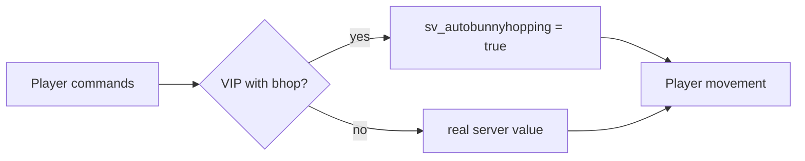

<div align="center">

# [VIP] Bhop

**VIP-only auto bunnyhop on CS2's native cvars: no ground sticking, and it never leaks to other players**

A [VIP Core](https://github.com/partiusfabaa/cs2-VIPCore) module · CounterStrikeSharp

[](https://github.com/koiie111/cs2-VIP-Bhop/releases/latest)
[](https://github.com/koiie111/cs2-VIP-Bhop/actions/workflows/build.yml)
[](https://github.com/roflmuffin/CounterStrikeSharp)
[](LICENSE)

[Русский](README.md) · **English**

</div>

---

VIP players bunnyhop on CS2's own autobhop (`sv_autobunnyhopping` + `sv_enablebunnyhopping`). The client and the server simulate their movement the same way, so there is no sticking or rubber-banding. Everyone else moves exactly as on a vanilla server: their values change neither on the server nor on their client.

It replaces the original `VIP_Bhop` module as is: same feature name and the same group settings.

|  | Original `VIP_Bhop` | This module |
|---|---|---|
| How a VIP jumps | The server pushes the player up by hand | CS2's native autobhop |
| Sticking to the ground | Yes, client and server disagree | No |
| Bhop for non-VIPs | Can happen after CS2 updates | No, verified with a hook call trace |
| Speed cap | Vanilla landing cap plus `MaxSpeed` | No vanilla cap (`sv_enablebunnyhopping`), only `MaxSpeed` |

> Tested on CS2 1.41.8.x (the 2026-09-23 update) with CounterStrikeSharp 1.0.376.

## Quick start

**Requires** [CounterStrikeSharp](https://github.com/roflmuffin/CounterStrikeSharp) 1.0.375 or newer (.NET 10) and [VIP Core](https://github.com/partiusfabaa/cs2-VIPCore).

1. Download `VIP_Bhop.zip` from the [latest release](https://github.com/koiie111/cs2-VIP-Bhop/releases/latest).
2. Remove the original module: `addons/counterstrikesharp/plugins/VIP_Bhop/`.
3. Extract the archive into `game/csgo/`. You get two files:
   ```
   addons/counterstrikesharp/plugins/VIP_Bhop/VIP_Bhop.dll
   addons/counterstrikesharp/gamedata/vip_bhop.json
   ```
4. Restart the server. CSS reads gamedata only at startup, so `css_plugins reload` will not pick it up.

When the module has loaded correctly, the server log shows:

```
[VIP Bhop] v2.6.1 loaded: OnSimulateUserCommands+SetupMove+ProcessMovement OK, ProcessUsercmds OK, PostThink OK
```

## Configuration

Give bhop to groups in the VIP Core config, `addons/counterstrikesharp/configs/plugins/VIPCore/vip.json`:

```json
"Bhop": {
  "Timer": 5,
  "MaxSpeed": 0
}
```

| Setting | Effect |
|---|---|
| `Timer` | Seconds after freezetime ends before bhop turns on. During warmup it is on right away. |
| `MaxSpeed` | Horizontal speed cap on jump. `0` means no cap, which is the smoothest option. The cap is applied on the server, so a small correction is possible when it kicks in. |

Players toggle bhop in the VIP menu. The `bhop.TimeToActivation` and `bhop.Activated` messages come from VIP Core's language files.

## How it works

CS2 has a single `sv_autobunnyhopping` value for the whole server. This module swaps that value for one player at a time: it is `true` while the game processes a VIP's movement, and the server's real value while it processes everyone else.



The VIP's client is sent `true` on its own, so its movement prediction matches the server. Everyone else is sent the real value. The server no longer broadcasts these cvars to all clients.

<details>
<summary><b>Technical details</b></summary>

<br>

- `FCVAR_REPLICATED` is removed from both cvars. Each client gets its own value through a single-recipient `CNETMsg_SetConVar`, and only when the value changes.
- The value is written straight into memory, with no change callbacks and no broadcast. This happens at the entry of every function where the game processes a specific player:

  | Function | When it runs |
  |---|---|
  | `CCSPlayerController::ProcessUsercmds` | The server receives the client's commands |
  | `CCSPlayer_MovementServices::SetupMove` | Movement setup; the cvars are already read here |
  | `CCSPlayer_MovementServices::ProcessMovement` | The movement itself |
  | `CCSPlayerPawnBase::PostThink` | The pawn's per-frame processing after movement |
  | `CBasePlayerController::OnSimulateUserCommands` | End of command simulation |

- The hooks only set the value. The module never calls or skips game functions itself. On CSS 1.0.375+ (KHook) doing so made the game process VIP commands again: speedhack, teleports and a server crash. No post hooks are used, since they do not fire on that CSS version.
- A VIP's value is reset when the next player enters, after the entity think phase, and at the start of every tick.
- The same idea is used by the autobhop style in [cs2kz-metamod](https://github.com/KZGlobalTeam/cs2kz-metamod).

</details>

## After CS2 updates

Functions are found by signatures. They live in a separate file, `gamedata/vip_bhop.json`, so you can update them without rebuilding the plugin. CSS auto-update only overwrites its own `gamedata.json` and leaves this file alone.

If the log reports a signature error after a CS2 patch:

1. Find the function in [ianlucas/cs2-signatures](https://github.com/ianlucas/cs2-signatures) and copy the **IDA-Style** value.
2. Paste it into `vip_bhop.json` for your platform (`windows` or `linux`).
3. Restart the server.

| Key in `vip_bhop.json` | Where to look in the tracker | Required |
|---|---|:---:|
| `VIP_Bhop_CCSPlayer_MovementServices_SetupMove` | SwiftlyS2 → `CCSPlayer_MovementServices::SetupMove` | ✅ |
| `VIP_Bhop_CCSPlayer_MovementServices_ProcessMovement` | CS2Fixes / SwiftlyS2 → `ProcessMovement` | ✅ |
| `VIP_Bhop_CBasePlayerController_OnSimulateUserCommands` | SwiftlyS2 → `CBasePlayerController::OnSimulateUserCommands` | ✅ |
| `VIP_Bhop_CCSPlayerController_ProcessUsercmds` | CS2Fixes / cs2kz-metamod → `ProcessUsercmds` | — |

If any required signature is missing, the module changes nothing: the cvars stay as on a vanilla server and bhop cannot leak. The `PostThink` signature comes from CSS's own gamedata and is updated along with CSS.

## Diagnostics

Both commands work from the server console, over rcon, and from the in-game console for admins with `@css/root`.

| Command | What it shows |
|---|---|
| `css_vipbhop_status` | Hook status, cvar values, call counters, handler time and each player's state |
| `css_vipbhop_trace` | The call order over 3 ticks: which function, for which player, and the value at entry |

> In the in-game console CS2 first prints `Unknown command`. That is expected: the command still reaches the server, and the reply follows.

<details>
<summary><b>Reading <code>css_vipbhop_status</code></b></summary>

<br>

```
[VIP Bhop] hook: OK
[VIP Bhop] real values: sv_autobunnyhopping=False sv_enablebunnyhopping=False, current: False/False
[VIP Bhop] v2.6.1, ProcessUsercmds hook: OK, PostThink hook: OK
[VIP Bhop] handler time: 159.0 ms total, 2.74 us per call (58002 calls; CSS native-to-managed dispatch not included)
[VIP Bhop] usercmds=11515 simulate=11639 setupMove=11032 processMovement=12784 postThink=11032 vip=17845 restores=5466
[VIP Bhop] #0 koiie: enabled=True active=True sent=True/True inMovementSet=True inControllerSet=True simulate/tick=1.00
[VIP Bhop] #1 Malw: enabled=False active=False sent=False/False inMovementSet=False inControllerSet=False simulate/tick=1.00
```

- **`real values`** should match your `server.cfg`, usually `False`.
- **The call counters** should be roughly equal. If `processMovement` is far above `simulate`, commands are being processed twice, which is a bug.
- **`restores`** counts how many times a VIP's value was reset before another player. It is expected to grow.
- **`simulate/tick`** should be about `1.00` for every player.
- **A non-VIP player** should show `False` everywhere.

</details>

<details>
<summary><b>Reading <code>css_vipbhop_trace</code></b></summary>

<br>

```
tick 1: U1- U0*- PRE P0*+ M0*+ T0*+ S0*+ P1- M1- T1- S1- POST
```

- `U` = commands received, `P` = SetupMove, `M` = ProcessMovement, `T` = PostThink, `S` = end of simulation.
- Then comes the player slot, `*` for a VIP, and the value of `sv_autobunnyhopping` at entry (`+` or `-`).
- `PRE` and `POST` mark the start and end of the entity think phase in the tick.

A non-VIP must always show `-` on `P`. A `+` there means they got a VIP's value.

</details>

### Troubleshooting

| Symptom | What to check |
|---|---|
| Everyone has bhop, VIP or not | Unload the module (`css_plugins unload VIP_Bhop`) and run `sv_autobunnyhopping`. If it is `true`, a config or another plugin turns it on. |
| A non-VIP has bhop only while a VIP is alive | Make sure every hook is `OK` in the log, then post the `css_vipbhop_trace` output in [issues](https://github.com/koiie111/cs2-VIP-Bhop/issues). |
| The module stopped working after a CS2 patch | Check the log for the error and update the signatures (see [After CS2 updates](#after-cs2-updates)). |
| A VIP sticks to the ground | Make sure `MaxSpeed` is `0` and the log has `ProcessUsercmds OK`. |

Find where your configs turn these cvars on:

```bash
grep -rniE "autobunnyhopping|enablebunnyhopping" game/csgo/cfg game/csgo/addons game/csgo/gamemodes*.txt
```

## Performance

The hooks fire about 5 times per player per tick. Each handler reads one parameter, does one `HashSet` lookup and writes the value to a cached address.

Measured on a live server: **2.7 µs per call, about 0.3 % of one core with three players**. The load grows in proportion to the player count, about 2 % at 20 players. CSS's native-to-C# dispatch comes on top and is not included in that figure. The `handler time` line in `css_vipbhop_status` shows the numbers for your server.

## Building from source

```bash
dotnet build VIP_Bhop.csproj -c Release
```

The output lands in `build/addons/counterstrikesharp/...` with the same layout as on the server. Building needs the .NET 10 SDK. `lib/VipCoreApi.dll` comes from [cs2-VIPCore](https://github.com/partiusfabaa/cs2-VIPCore) (MIT) and is not copied into the output. Pushing a `v*` tag makes GitHub Actions publish a release with `VIP_Bhop.zip`.

## Credits

- [thesamefabius / partiusfabaa](https://github.com/partiusfabaa/cs2-VIPCore) — VIP Core and the original `VIP_Bhop` module
- [KZGlobalTeam/cs2kz-metamod](https://github.com/KZGlobalTeam/cs2kz-metamod) — the per-player cvar technique
- [ianlucas/cs2-signatures](https://github.com/ianlucas/cs2-signatures) — signature tracker

## License

[MIT](LICENSE)
