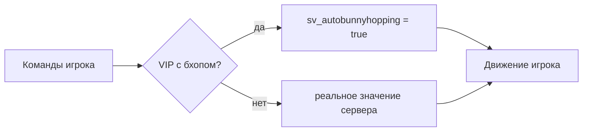

<div align="center">

# [VIP] Bhop

**Автобхоп только для VIP на встроенных переменных CS2, без прилипаний и утечки на остальных игроков**

Модуль для [VIP Core](https://github.com/partiusfabaa/cs2-VIPCore) · CounterStrikeSharp

[](https://github.com/koiie111/cs2-VIP-Bhop/releases/latest)
[](https://github.com/koiie111/cs2-VIP-Bhop/actions/workflows/build.yml)
[](https://github.com/roflmuffin/CounterStrikeSharp)
[](LICENSE)

**Русский** · [English](README.en.md)

</div>

---

VIP-игрок прыгает на родном автобхопе CS2 (`sv_autobunnyhopping` + `sv_enablebunnyhopping`). Клиент и сервер считают его движение одинаково, поэтому бхоп идёт без прилипаний и рывков. Остальные игроки двигаются как на ванильном сервере: переменные для них не меняются ни на сервере, ни у клиента.

Модуль заменяет оригинальный `VIP_Bhop` без переделки конфигов: у него то же имя фичи и те же настройки групп.

|  | Оригинальный `VIP_Bhop` | Этот модуль |
|---|---|---|
| Как прыгает VIP | Сервер подкидывает игрока вручную | Родной автобхоп CS2 |
| Прилипания к земле | Есть: клиент и сервер считают по-разному | Нет |
| Бхоп у игроков без VIP | Возможен после обновлений CS2 | Нет, проверено по порядку вызовов |
| Потолок скорости | Ванильный при приземлении, плюс `MaxSpeed` | Ванильного нет (`sv_enablebunnyhopping`), только `MaxSpeed` |

> Проверено на CS2 1.41.8.x (обновление от 23.09.2026) с CounterStrikeSharp 1.0.376.

## Быстрый старт

**Нужно:** [CounterStrikeSharp](https://github.com/roflmuffin/CounterStrikeSharp) версии 1.0.375 или новее (.NET 10) и [VIP Core](https://github.com/partiusfabaa/cs2-VIPCore).

1. Скачайте `VIP_Bhop.zip` из [последнего релиза](https://github.com/koiie111/cs2-VIP-Bhop/releases/latest).
2. Удалите оригинальный модуль: `addons/counterstrikesharp/plugins/VIP_Bhop/`.
3. Распакуйте архив в `game/csgo/`. Появятся два файла:
   ```
   addons/counterstrikesharp/plugins/VIP_Bhop/VIP_Bhop.dll
   addons/counterstrikesharp/gamedata/vip_bhop.json
   ```
4. Перезапустите сервер. Gamedata читается только при старте CSS, `css_plugins reload` её не подхватит.

Если модуль загрузился правильно, в логе сервера будет строка:

```
[VIP Bhop] v2.6.1 loaded: OnSimulateUserCommands+SetupMove+ProcessMovement OK, ProcessUsercmds OK, PostThink OK
```

## Настройка

Бхоп выдаётся группам в конфиге VIP Core, `addons/counterstrikesharp/configs/plugins/VIPCore/vip.json`:

```json
"Bhop": {
  "Timer": 5,
  "MaxSpeed": 0
}
```

| Параметр | Что делает |
|---|---|
| `Timer` | Через сколько секунд после конца freezetime включается бхоп. В разминке включается сразу. |
| `MaxSpeed` | Потолок горизонтальной скорости при прыжке. `0` — без ограничения, это самый плавный вариант. Потолок срабатывает на сервере, поэтому при его срабатывании возможен небольшой рывок. |

Игрок включает и выключает бхоп в VIP-меню. Сообщения `bhop.TimeToActivation` и `bhop.Activated` берутся из языковых файлов VIP Core.

## Как это работает

В CS2 переменная `sv_autobunnyhopping` одна на весь сервер. Модуль подменяет её значение точечно: пока игра обрабатывает движение VIP, там `true`, пока обрабатывает остальных — реальное значение сервера.



Клиенту VIP отдельно отправляется `true`, чтобы его предсказание движения совпадало с сервером. Остальным отправляется реальное значение. Общая рассылка этих переменных всем клиентам отключена.

<details>
<summary><b>Технические подробности</b></summary>

<br>

- С обеих переменных снимается флаг `FCVAR_REPLICATED`. Каждый клиент получает своё значение через `CNETMsg_SetConVar` с одним получателем, и только когда значение меняется.
- Значение пишется в память напрямую, без колбэков изменения и без рассылки. Это делается на входе в каждую функцию, где игра обрабатывает конкретного игрока:

  | Функция | Когда вызывается |
  |---|---|
  | `CCSPlayerController::ProcessUsercmds` | Сервер принимает команды от клиента |
  | `CCSPlayer_MovementServices::SetupMove` | Подготовка движения, здесь переменные уже читаются |
  | `CCSPlayer_MovementServices::ProcessMovement` | Само движение |
  | `CCSPlayerPawnBase::PostThink` | Обработка пешки после движения |
  | `CBasePlayerController::OnSimulateUserCommands` | Завершение симуляции команд |

- Хуки только выставляют значение. Модуль никогда сам не вызывает и не пропускает функции игры: на CSS 1.0.375+ (KHook) это приводило к повторной обработке команд VIP, то есть к сверхскорости, телепортам и падению сервера. Post-хуки не используются, на этой версии CSS они не срабатывают.
- Значение VIP сбрасывается при входе следующего игрока, после фазы обработки сущностей и в начале каждого тика.
- Тот же принцип использует стиль autobhop в [cs2kz-metamod](https://github.com/KZGlobalTeam/cs2kz-metamod).

</details>

## После обновлений CS2

Адреса функций ищутся по сигнатурам. Они лежат в отдельном файле `gamedata/vip_bhop.json`, поэтому их можно обновить без пересборки плагина. Автообновление CSS перезаписывает только свой `gamedata.json`, этот файл оно не трогает.

Если после патча CS2 в логе появилась ошибка про сигнатуру:

1. Найдите функцию в [ianlucas/cs2-signatures](https://github.com/ianlucas/cs2-signatures) и скопируйте значение из колонки **IDA-Style**.
2. Вставьте его в `vip_bhop.json` для своей платформы (`windows` или `linux`).
3. Перезапустите сервер.

| Ключ в `vip_bhop.json` | Где искать в трекере | Обязательна |
|---|---|:---:|
| `VIP_Bhop_CCSPlayer_MovementServices_SetupMove` | SwiftlyS2 → `CCSPlayer_MovementServices::SetupMove` | ✅ |
| `VIP_Bhop_CCSPlayer_MovementServices_ProcessMovement` | CS2Fixes / SwiftlyS2 → `ProcessMovement` | ✅ |
| `VIP_Bhop_CBasePlayerController_OnSimulateUserCommands` | SwiftlyS2 → `CBasePlayerController::OnSimulateUserCommands` | ✅ |
| `VIP_Bhop_CCSPlayerController_ProcessUsercmds` | CS2Fixes / cs2kz-metamod → `ProcessUsercmds` | — |

Если не найдена хотя бы одна обязательная сигнатура, модуль ничего не меняет: переменные остаются как на ванильном сервере, и утечки бхопа не будет. Сигнатура `PostThink` берётся из gamedata самого CSS и обновляется вместе с ним.

## Диагностика

Обе команды работают из консоли сервера, через rcon и из консоли игры для админов с флагом `@css/root`.

| Команда | Что показывает |
|---|---|
| `css_vipbhop_status` | Состояние хуков, значения переменных, счётчики вызовов, время работы и состояние каждого игрока |
| `css_vipbhop_trace` | Порядок вызовов за 3 тика: какая функция, для какого игрока и с каким значением на входе |

> В консоли игры CS2 сначала выводит `Unknown command`. Это нормально: команда всё равно уходит на сервер, ответ появится следом.

<details>
<summary><b>Как читать <code>css_vipbhop_status</code></b></summary>

<br>

```
[VIP Bhop] hook: OK
[VIP Bhop] real values: sv_autobunnyhopping=False sv_enablebunnyhopping=False, current: False/False
[VIP Bhop] v2.6.1, ProcessUsercmds hook: OK, PostThink hook: OK
[VIP Bhop] handler time: 159.0 ms total, 2.74 us per call (58002 calls; CSS native-to-managed dispatch not included)
[VIP Bhop] usercmds=11515 simulate=11639 setupMove=11032 processMovement=12784 postThink=11032 vip=17845 restores=5466
[VIP Bhop] #0 koiie: enabled=True active=True sent=True/True inMovementSet=True inControllerSet=True simulate/tick=1.00
[VIP Bhop] #1 Malw: enabled=False active=False sent=False/False inMovementSet=False inControllerSet=False simulate/tick=1.00
```

- **`real values`** должно совпадать с вашим `server.cfg`, обычно это `False`.
- **Счётчики вызовов** должны быть примерно равны между собой. Если `processMovement` намного больше `simulate`, команды обрабатываются повторно, и это ошибка.
- **`restores`** — сколько раз значение VIP сбрасывалось перед другим игроком. Рост — это нормально.
- **`simulate/tick`** у каждого игрока должен быть около `1.00`.
- **У игрока без VIP** везде должно быть `False`.

</details>

<details>
<summary><b>Как читать <code>css_vipbhop_trace</code></b></summary>

<br>

```
tick 1: U1- U0*- PRE P0*+ M0*+ T0*+ S0*+ P1- M1- T1- S1- POST
```

- `U` — приём команд, `P` — SetupMove, `M` — ProcessMovement, `T` — PostThink, `S` — завершение симуляции.
- Затем идёт номер слота игрока, `*` у VIP и значение `sv_autobunnyhopping` на входе в функцию (`+` или `-`).
- `PRE` и `POST` — начало и конец обработки сущностей в тике.

У игрока без VIP на `P` всегда должен стоять `-`. Если там `+`, значит, он получил значение VIP.

</details>

### Частые проблемы

| Симптом | Что проверить |
|---|---|
| Бхоп у всех, даже без VIP | Выгрузите модуль (`css_plugins unload VIP_Bhop`) и выполните `sv_autobunnyhopping`. Если значение `true`, его включает конфиг или другой плагин. |
| Бхоп у игрока без VIP только пока VIP жив | Проверьте, что все хуки в логе `OK`. Затем пришлите вывод `css_vipbhop_trace` в [issues](https://github.com/koiie111/cs2-VIP-Bhop/issues). |
| Модуль не работает после патча CS2 | Смотрите ошибку в логе и обновите сигнатуры (раздел [После обновлений CS2](#после-обновлений-cs2)). |
| VIP прилипает к земле | Проверьте, что `MaxSpeed` равен `0`, и что в логе есть `ProcessUsercmds OK`. |

Найти, где в конфигах включаются эти переменные:

```bash
grep -rniE "autobunnyhopping|enablebunnyhopping" game/csgo/cfg game/csgo/addons game/csgo/gamemodes*.txt
```

## Производительность

Хуки срабатывают примерно 5 раз на игрока за тик. Каждый обработчик читает один параметр, делает одну проверку в `HashSet` и пишет значение по заранее сохранённому адресу.

Замер на живом сервере: **2,7 мкс на вызов, около 0,3 % одного ядра при трёх игроках**. Нагрузка растёт пропорционально числу игроков, при 20 игроках это около 2 %. Ещё добавляется время перехода CSS из движка в C#, в замер оно не входит. Актуальные цифры для вашего сервера показывает строка `handler time` в `css_vipbhop_status`.

## Сборка из исходников

```bash
dotnet build VIP_Bhop.csproj -c Release
```

Готовые файлы появятся в `build/addons/counterstrikesharp/...` в той же структуре, что на сервере. Для сборки нужен .NET SDK 10. Файл `lib/VipCoreApi.dll` взят из [cs2-VIPCore](https://github.com/partiusfabaa/cs2-VIPCore) (MIT) и в сборку не копируется. При пуше тега `v*` GitHub Actions сам выпускает релиз с `VIP_Bhop.zip`.

## Благодарности

- [thesamefabius / partiusfabaa](https://github.com/partiusfabaa/cs2-VIPCore) — VIP Core и оригинальный модуль `VIP_Bhop`
- [KZGlobalTeam/cs2kz-metamod](https://github.com/KZGlobalTeam/cs2kz-metamod) — приём с переменными для отдельного игрока
- [ianlucas/cs2-signatures](https://github.com/ianlucas/cs2-signatures) — трекер сигнатур

## Лицензия

[MIT](LICENSE)
